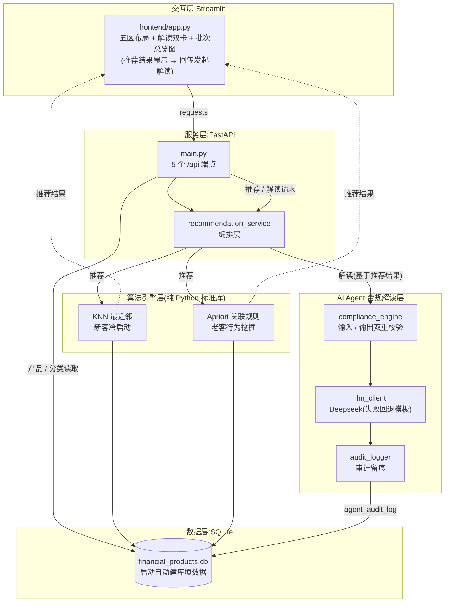

# 金融产品智能推荐系统

> 面向银行理财经理的轻量化智能辅助工具 —— 「算法精准匹配 · AI 合规解读 · 人工复核兜底」三层递进体系,让算法推荐可信、可解释、可审计。

[](requirements.txt)
[](#license)
[](#文档)

## ⚠️ 合规声明

本系统仅为银行内部业务辅助工具:

- **不构成任何投资建议**,不输出买卖指导、收益承诺、保本暗示
- 所有推荐结果与 AI 解读**仅供内部参考**,须经理财经理人工复核后方可使用
- **无任何自动化对外触达能力**,对客话术仅为参考草稿,禁止系统自动发送

## ✨ 核心亮点

- 🎯 **双算法引擎** — 新客户没有历史数据?KNN 按画像匹配;老客户有购买记录?Apriori 从行为中挖出"买了 A 的客户常买 B"
- 🤖 **AI 解读双模式** — 同一套流程产出两种文稿:给经理看的合规解读 + 给客户听的参考话术
- 🛡️ **三层合规风控** — AI 指令自带合规边界 + 违规表述自动拦截(会智能区分合规话术,不误伤)+ 最终由经理人工拍板
- 📋 **全链路留痕备查** — 每次 AI 调用都存档(输入、输出、校验结论),存档失败也不影响正常使用
- ⚙️ **开箱即用** — 一条命令启动、自带一键自检、零 key 演示模式(不配 API key 也能跑完整演示)

## 🏗️ 系统架构

四层架构已全部打通:数据层(SQLite,首次启动自动建库并填充示例数据)→ 算法层(纯 Python 双算法)→ AI Agent 合规解读层(合规引擎 + 大模型)→ 交互层(Streamlit)。**流程为「先推荐、后解读」**:算法结果回传页面展示后,再携带推荐结果与客户上下文请求 AI 解读;解读支线经生成前校验 → 大模型生成 → 生成后校验 → 审计落库。



精简目录树:

```text
Finance-CRM-Agent/
├── backend/
│   ├── main.py                        # FastAPI 入口(5 个 /api 端点)
│   ├── smoke_test.py                  # 一键自检脚本(8 项检查,全部通过即退出码 0)
│   ├── services/
│   │   └── recommendation_service.py  # 编排层:推荐与解读的总调度
│   ├── agent/                         # AI Agent 合规解读层
│   │   ├── compliance_engine.py       # 合规规则引擎(生成前后双重把关)
│   │   ├── llm_client.py              # Deepseek 客户端(失败自动回退,不报错)
│   │   ├── prompt_templates.py        # 提示词模板 + 备用模板(缺什么自动补什么)
│   │   ├── audit_logger.py            # 审计留痕写入
│   │   └── rag_retriever.py           # 知识库检索(一期占位,二期接入产品文档)
│   ├── algorithms/                    # 纯 Python 实现,零第三方算法库
│   │   ├── nearest_neighbor.py        # KNN 加权距离匹配(分类权重 0.4 / 金额 0.6)
│   │   └── association_rules.py       # Apriori 关联规则("买了 A 的客户常买 B")
│   └── database/
│       └── db_connection.py           # SQLite 连接 + 首次启动自动建库填数据
├── frontend/
│   └── app.py                         # Streamlit 单页(五区布局 + 解读双卡)
├── start_demo.py / .bat / .sh         # 一键启动(自动读取密钥 / 自检 / 演示模式)
└── requirements.txt                   # 依赖清单
```

## 🚀 Quick Start

环境要求:Python 3.11+

```bash
# 1. 克隆仓库
git clone https://github.com/Everly-huang/Finance-CRM-Agent.git
cd Finance-CRM-Agent

# 2. 安装依赖
pip install -r requirements.txt

# 3. 一键启动(自动拉起后端 + 前端双进程)
python start_demo.py
```

启动后访问:

| 服务 | 地址 |
|---|---|
| 前端页面 | http://127.0.0.1:8501 |
| 后端 API(交互文档) | http://127.0.0.1:8000/docs |

- **数据库无需任何准备**:首次启动自动建库并填充示例数据(10 个示例产品 + 8 位客户 38 条历史购买记录),SQLite 文件在本地生成、不随仓库分发
- Windows 用户可直接双击 `start_demo.bat`;启动脚本会自动读取密钥配置、等待两个服务就绪,Ctrl+C 一键停止

<!-- 截图:主界面(五区布局) -->

### 🎬 零 key 体验:DEMO_MODE

不配 Deepseek API key 也能完整体验全部功能:

```bash
python start_demo.py --demo --smoke
```

- `--demo`:AI 解读返回预置演示样例,完全不会调用大模型 API —— 公开演示不用担心 key 消耗或泄露
- 默认模式:解读真实调用大模型;没配 key、断网或超时时自动改用内置合规模板,功能照常可用

### 接入真实 Deepseek Key(可选)

创建 `frontend/.streamlit/secrets.toml`(已被 .gitignore 排除,不入 git):

```toml
DEEPSEEK_API_KEY = "sk-xxx"
```

启动脚本会自动把 key 传给后端;也可用 `DEEPSEEK_BASE_URL` / `DEEPSEEK_MODEL` 环境变量自定义接口地址与模型。

### ✅ 一键自检

后端启动后运行:

```bash
cd backend && python smoke_test.py              # 8 项检查,全部通过即退出码 0
python smoke_test.py --expect-demo              # 后端以演示模式启动时,校验演示模式
```

覆盖:建库、两种算法的推荐与异常兜底、AI 解读双模式接口契约。

## 🎯 功能特性

### 双算法场景化推荐

| 场景 | 算法 | 说明 |
|---|---|---|
| 新客户冷启动 | KNN 最近邻 | 按客户偏好分类与投资金额找最相似的产品;客户画像偏离常规时自动转热门产品兜底,每次输出 6 条 |
| 老客户行为挖掘 | Apriori 关联规则 | 从历史购买记录里挖出"买了 A 的客户常买 B"的规律,标注支持度/置信度(历史频次与可靠程度);凑不满 6 条用热门产品补齐 |

<!-- 截图:推荐结果区(依据摘要 + 批次总览图 + 产品表格) -->

### AI 解读双模式

| 模式 | 用途 | 关键约束 |
|---|---|---|
| `analysis` | 合规解读(内部参考底稿) | 给理财经理看的底稿,全文第三人称;一旦出现对客称呼「您」,整篇自动换成合规模板 |
| `script` | 对客参考话术 | 双区结构(【对客参考话术】+【经理备注】),算法内部指标只写进备注区(不给客户看);风险揭示必带;脚注"参考草稿·需人工复核·禁止系统自动发送" |

两种文稿走同一套流程(生成前检查 → 生成 → 生成后把关 → 留痕);话术下载只含对客部分,文件头带三重提醒。

<!-- 截图:AI 双模式解读(解读卡 + 对客参考话术卡) -->

## 🛡️ 合规设计

三层递进风控,所有 AI 输出必须逐层通过:

1. **给 AI 的提示词自带边界** — 明确"读者是谁、什么不能说"(禁投资建议/收益承诺/角色篡改),且优先级最高,后续任何指令都不能突破
2. **违规表述自动拦截** — 自建 `compliance_engine`:违禁词黑名单 + 敏感句式识别 + 恶意指令防护,还会智能区分"合规话术"与"真实违规"避免误伤;生成前拦违规输入,生成后整篇替换违规输出
3. **人工复核兜底** — 页面提供"我已复核"确认步(仅留痕,不会放行任何内容),系统从不自动触达客户

全程留痕备查:每次 AI 调用都存档(输入、输出、校验结论、是否降级、所用模型),存档失败也不影响正常使用。

## 📚 文档

- [金融产品智能推荐系统需求文档.md](金融产品智能推荐系统需求文档.md) — 权威规格(现状/规划已标注)
- [项目落地清单.md](项目落地清单.md) — 未实现项与验收口径
- [CLAUDE.md](CLAUDE.md) — 开发指引(架构/常用命令/已知陷阱)

**二期规划**(当前未实现,详见落地清单):RAG 知识库增强(Chroma 向量库)、Pydantic 请求/响应模型、API 4xx 错误码规范、算法输出数值字段与匹配度可视化等。

## License

本项目采用 [MIT License](LICENSE)。

## 后端参考

https://github.com/Songyixin0109/CRM
