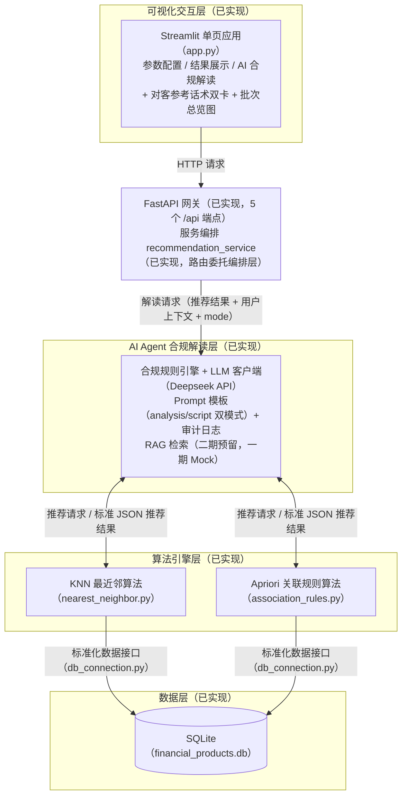

# 金融产品智能推荐系统需求说明文档

## 1. 文档信息

| 条目 | 内容 |
|---|---|
| 产品名称 | 金融产品智能推荐系统（合规版） |
| 产品定位 | 面向理财经理的轻量化金融智能辅助工具，基于双数据挖掘算法+AI大模型，实现金融产品智能匹配、行为挖掘、合规化结果解读，AI结果仅做辅助解读，强制人工复核，满足金融风控合规要求。 |
| 目标用户 | 银行/券商理财经理、金融客户经理、金融产品运营人员 |
| 版本号 | V1.2 |
| 文档用途 | 项目落地依据、产品设计方案沉淀 |
| 文档权威版本 | 本 Markdown 文件为唯一现行版本；历史 .docx 版本（《金融产品智能推荐Agent系统》产品需求文档（PRD）.docx）为本地存档（不入仓库），内容以本文件为准 |
| 实现状态 | 四层架构一期全链路贯通 + 前端业务化 N1-N5 + AI 解读双模式（analysis 合规解读 / script 对客参考话术）+ 批次总览图均已实现；剩余规划（RAG 二期、Pydantic 模型、API 错误码规范、算法输出数值字段等）详见《项目落地清单.md》 |

## 2. 项目背景与痛点分析

### 2.1 业务背景

金融理财业务中，理财经理需要根据用户**风险偏好、投资预算、历史购买行为**，为客户匹配适配的理财产品。传统金融CRM系统仅具备客户数据存储、产品展示、记录归档能力，缺乏智能分析能力，无法自动挖掘用户偏好与产品关联关系，理财经理人工筛选产品效率低、匹配主观性强、缺乏数据依据。

同时，通用AI对话工具存在**输出不专业、无金融约束、易产生投资建议、无法解释推荐逻辑**等合规问题，无法直接用于金融职场业务。

### 2.2 现存业务痛点

- **匹配效率低**：人工对照产品风险、起投金额、用户偏好筛选，耗时久、易出错
- **推荐无依据**：人工推荐主观化，无数据、算法指标支撑，客户说服力弱
- **新老用户无差异化**：新用户无行为数据、老用户有购买习惯，传统工具无法区分推荐策略
- **结果不可解释**：算法输出结果专业晦涩，理财经理无法快速理解匹配逻辑与风险适配性
- **合规风险高**：通用AI易输出收益承诺、投资指导等违规内容，不符合金融监管要求

### 2.3 产品解决方案

针对上述痛点，本产品构建了「算法精准匹配—AI合规解读—人工复核兜底」的三层递进式智能推荐体系，实现金融CRM从“数据记录工具”向“智能决策助手”的升级。

1. **底层算法双引擎驱动，实现精准匹配**

   基于客户画像与产品特征库，融合近邻匹配与关联规则算法，实现产品与客户的多维自动匹配：

   - 新客冷启动：依据投资偏好、预算等画像特征，通过特征向量加权近邻匹配快速生成初始推荐池，缩短首单决策周期；
   - 老客深度运营：基于历史购买行为挖掘产品关联规则，识别复购倾向与组合偏好，实现”已购A则推荐B”的精准关联；
   - 全量约束过滤（规划）：风险等级适配性、起投金额门槛、产品可售状态校验等硬性规则为二期增强方向（见《项目落地清单》），一期以输入边界裁剪与人工复核兜底。

   引擎输出每项推荐均附带推荐类型标签，关联推荐附带支持度/置信度等量化指标（匹配度评分为规划字段，见《项目落地清单》），为理财经理提供客观数据依据，增强客户说服力。

2. **中层AI Agent合规解读，弥合专业鸿沟**

   在算法输出与理财经理之间设置专属金融合规AI层，对推荐结果进行“翻译”与“把关”：

   - 结果通俗化：将算法指标转化为理财场景话术，如"该客户偏好稳健理财分类、预算5万元，所推荐产品风险等级为低风险，与客户偏好特征的距离为系统内最小，建议人工复核后使用"，降低理解门槛；
   - 逻辑可视化：自动生成推荐理由摘要（如"基于您过往偏好固收类产品，且同类型客户近期关注该产品"），让理财经理快速掌握适配逻辑；
   - 合规防火墙：内置金融监管规则库，拦截收益承诺、保本暗示、投资指导等违规表述，确保所有对外输出内容符合合规要求。（已实现：合规规则引擎输入校验 + 输出后校验 + 否定语境豁免，见 5.4；解读为 analysis/script 双模式，每次调用审计留痕，见 6.4）

3. **顶层人工复核兜底，构建业务闭环**

   系统最终输出的推荐方案及AI解读，由理财经理进行”最后一公里”的人工复核。理财经理可依据自身对客户的感性认知，补充人情化话术、形成最终方案（推荐权重微调为二期规划，见《项目落地清单》）。该模式保留了人工的专业温度，同时借助算法大幅提升选品效率，形成”机器计算快、AI讲得清、人工把得准”的闭环业务模式。（已实现：前端落地人工复核确认步，仅留痕自证、无解锁放行逻辑，见 7.1 / 第 9 章）

## 3. 产品核心定位与价值

### 3.1 产品定位

金融场景轻量化智能辅助Agent，**只做分析、不做决策、不输出投资建议、不直接触达客户**，全程为理财经理提供内部业务参考，所有结果必须人工审核后使用。

### 3.2 核心价值

- **效率价值**：秒级完成产品筛选与匹配，替代人工统计、对比、筛选工作
- **精准价值**：双算法覆盖新老用户场景，基于特征相似度+用户行为挖掘，推荐结果可量化、可追溯
- **落地价值**：AI通俗解读算法指标，降低理财经理使用门槛，解决算法黑盒问题
- **合规价值**：全链路约束AI输出，规避金融营销违规风险，适配行业监管要求

## 4. 用户角色与场景分析

### 4.1 目标用户角色

理财经理/金融客户经理：负责客户维护、产品匹配、理财咨询、客户需求跟进，需要高效、合规、有数据依据的产品推荐辅助工具。

### 4.2 核心使用场景

1. **新客户无历史行为场景**：仅知晓用户投资类型、预算，通过KNN算法匹配相似度最高的理财产品，同时区分常规客户与特征异常客户，分别推送相似产品/热门高收益产品。
2. **老客户有购买记录场景**：基于用户历史购买行为，通过Apriori关联规则挖掘产品组合关联关系，推送高置信度关联产品。
3. **业务复盘与话术准备场景**：通过AI Agent解读推荐逻辑、产品风险、适配人群，辅助理财经理制作合规沟通话术与客户分析报告。（已实现：话术准备由 AI 解读的 script 模式（对客参考话术，双区结构 + 合规约束）支撑，见 6.4）

## 5. 产品整体功能架构

系统采用四层能力架构设计，自下而上分别为数据层、算法引擎层、AI Agent合规解读层和可视化交互层，各层职责清晰、接口规范，形成从数据存储到智能推荐再到人机交互的完整闭环。一期聚焦核心推荐能力与LLM基础解读体验，并为后续RAG增强预留扩展接口。

### 5.1 完整架构

<!-- 注：原文未含图形，下图为依据本节文字描述绘制的四层架构示意 -->



```text
Finance_CRM_Agent/
├── backend/
│   ├── main.py                           # FastAPI 主入口（5 个 /api 端点 + 根路径健康检查，路由委托编排层）
│   ├── smoke_test.py                     # 冒烟自检脚本（ENG-04，支持 --expect-demo）
│   ├── services/                         # 业务编排层 
│   │   └── recommendation_service.py     # 推荐编排 + AI 解读双模式流水线（校验→RAG→LLM→后校验→审计）
│   ├── agent/                            # AI Agent 核心包 
│   │   ├── compliance_engine.py          # 合规规则引擎（黑名单+正则+注入检测+否定语境豁免；双模式专项校验）
│   │   ├── llm_client.py                 # LLM API 客户端（Deepseek，30s 超时+重试1次+模板降级）
│   │   ├── prompt_templates.py           # Prompt 模板（analysis/script 双 System Prompt+降级模板+演示样例）
│   │   ├── audit_logger.py               # 审计日志写入（agent_audit_log 表）
│   │   ├── rag_retriever.py              # RAG 检索（一期 Mock 占位，二期 Chroma 无缝升级）
│   │   └── knowledge_base/               # 知识库目录（当前不存在，由二期 RAG 规划创建，见《项目落地清单》AGT-06）[规划]
│   ├── algorithms/                       # 算法引擎层
│   │   ├── nearest_neighbor.py           # 最近邻推荐算法
│   │   └── association_rules.py          # 关联规则推荐算法
│   └── database/                         # 数据层
│       ├── db_connection.py              # 数据库连接（含惰性建表播种与审计日志写入）
│       └── financial_products.db         # SQLite 数据库（四张表：三张业务表 + agent_audit_log，首次产品数据访问自动建表播种（惰性初始化），幂等）
├── frontend/                             # 可视化交互层
│   ├── app.py                            # Streamlit 单页应用（五区布局 + 区4双卡 + 批次总览图，业务化 N1-N5）
│   └── .streamlit/                       # Streamlit 配置目录（主题、密钥等）
│       ├── config.toml                   # Streamlit 主题（序贯蓝系，银行内部工具风格）
│       └── secrets.toml                  # Deepseek key 模板（空 key 即降级，key 不入 git）
├── start_demo.py / start_demo.bat / start_demo.sh   # 一键启动（secrets 桥接 → 双进程 → 轮询就绪；--smoke/--demo）
└── requirements.txt                      # 依赖清单（finance-crm 环境已齐装）

图例：[规划] = 未实现，见《项目落地清单.md》
```

技术栈总览：

| 层级 | 当前实现 | 目标形态 | 说明 |
|---|---|---|---|
| 数据层 | SQLite（过程式数据访问，无 ORM） | SQLite + DB Browser | 轻量级，零配置，适合本地开发 |
| 算法层 | Python 纯手写实现（仅标准库：KNN 加权欧氏距离 / Apriori 频繁项集） | 可迁移 scikit-learn KNN / mlxtend Apriori（可选演进） | 零第三方依赖；先手写理解原理，后可换成熟算法库 |
| Agent层 | 已实现：Deepseek API（requests 直连 OpenAI 兼容端点，30s 超时+重试1次+模板降级）+ 自建合规规则引擎（黑名单/正则/注入检测/否定语境豁免 + analysis/script 双模式专项校验） | RAG 知识库增强（二期）+ 更多模型适配 | 一期直接调用API，无需本地GPU；RAG 检索模块现以 Mock 占位，二期升级见《项目落地清单》AGT-06 |
| 交互层 | 已实现：Streamlit + Plotly + Requests（单页五区布局 + 区4双卡 + 批次总览图，主题 config.toml） | 当前形态已达成；剩余增量（匹配度柱状图等）见《项目落地清单》 | 纯Python，无需前端构建工具 |
| 编排层 | FastAPI 已实现（5 个 /api 端点，路由全部委托编排层；POST 参数为约定式 dict） | FastAPI + Pydantic（规划） | 高性能API框架，自动生成接口文档；Pydantic 请求/响应模型为规划项（SVC-04），见《项目落地清单》 |

### 5.2 数据层

基于SQLite轻量级关系型数据库（`financial_products.db`）构建，模拟金融CRM核心数据环境。包含：

- sample_products：金融产品信息
- customer_records：历史购买记录（关联分析数据源）
- customer_inputs：用户推荐记录
- agent_audit_log：AI Agent 解读审计日志（调用时间、输入、输出、合规校验结果、降级标记/模型；双模式解读以输入内 mode 字段区分）

（注：SQLite 内部自动维护的 sqlite_sequence 自增序列表非业务表，不计入数据模型。）

建表与播种为**惰性初始化**：首次产品数据访问时由 `db_connection.py` 自动执行（种子库含 10 个产品、8 位客户 38 条购买记录、3 个产品分类），模块级标志保证幂等、重复启动不重复播种。

数据关系：

- 产品分类：70(稳健理财)、71(成长基金)、72(进取投资)
- 风险等级：低风险、中低风险、中风险、中高风险、高风险、极高风险
- 客户行为：通过购买记录构建事务数据库

数据层为上层算法提供标准化的数据输入接口（`db_connection.py`），模拟CRM系统的业务字段定义与产品分类规则，支持通过DB Browser for SQLite等工具进行可视化数据管理与校验。

### 5.3 算法引擎层

采用双算法并行的推荐架构，提供核心推荐计算能力：

- KNN最近邻算法（`nearest_neighbor.py`）：基于客户投资类型、投资预算双维度特征与产品特征做加权近邻匹配，实现新客户无行为数据场景的冷启动推荐。输入投资偏好分类ID与投资金额，输出与输入画像最相近的 Top-K 产品列表（分类权重0.4/金额权重0.6，见6.2）
- Apriori关联规则算法（`association_rules.py`）：挖掘历史购买事务中的产品关联模式，发现”购买A产品的用户也常购买B产品”的规则。输入目标产品ID，输出关联产品列表及支持度/置信度指标（支持度0.2、置信度0.5为一期固定默认阈值，参数化见《项目落地清单》）

接口预留说明：算法层以标准JSON格式输出推荐结果（包含产品ID、推荐类型标签；关联推荐含支持度/置信度；匹配度评分为规划字段，见《项目落地清单》），该格式同时兼容后续AI Agent的输入接口规范，确保算法升级或替换时Agent层无需改动。

### 5.4 AI Agent层（一期）

金融合规专属大模型助手，负责结果解读、指标通俗释义、风险提示、合规校验。 已落地**解读双模式**：`analysis` 合规解读（内部参考，读者为理财经理）与 `script` 对客参考话术（双区结构，供理财经理人工复核后参考使用）。未实现项（RAG 二期等）见《项目落地清单.md》。

**设计原则：一期优先完成LLM接入与基础解读/话术能力验证，Agent层对外接口按完整架构设计预留，RAG检索模块以Mock实现占位，二期无缝升级（替换实现无需改调用方）。**

#### 整体架构

- AI Agent合规解读层（含二期RAG接口预留）
  - 合规规则引擎（`compliance_engine.py`）
    - 关键词黑名单过滤 + 正则拦截 + 注入检测 + 输出后校验 + **否定语境豁免**（命中项所在句含「不等于/不构成/请勿」等否定词组时放行，避免合规教育话术被误拦）
    - 双模式专项校验（`validate_output(mode)`）：analysis 模式追加受众检测（检出「您」即受众漂移，审计记 `audience_drift`）；script 模式追加话术专项规则（SR-1 裸收益数字只扫对客区 / SR-2 饥饿营销 / SR-4 绝对化用语 / 算法指标词分区扫描——算法指标原文只落备注区）
  - LLM客户端（`llm_client.py`）
    - requests 直连 Deepseek OpenAI 兼容端点（可选 DEEPSEEK_BASE_URL / DEEPSEEK_MODEL）；30s 超时 + 重试 1 次；无 key/断网/超时回退预置模板并标注"基础版解读"（`degraded=true`），保证功能不中断
  - Prompt模板（`prompt_templates.py`）
    - analysis/script 双 System Prompt（受众定位 + 合规边界 + 输出结构约束）+ 降级模板 + 演示样例 + 确定性话术 builder + **强制要素兜底**（风险揭示/脚注/备注区标题等缺失时自动追加，幂等）
  - 审计日志模块（`audit_logger.py`，写入 `agent_audit_log` 表）
    - 每次 Agent 调用落一条审计记录（输入、输出、合规校验结果、降级标记/模型）；`compliance_result` 取值：pass / blocked_input / blocked_output / audience_drift
  - 【二期预留】RAG检索模块（`rag_retriever.py`）
    - 一期以Mock占位（返回空上下文），接口签名与二期 Chroma 实现保持一致，替换实现无需改调用方（AGT-06）

#### 一期实现范围

（截至 2026-09-04，一期列已全部落地 ✅；二期列不动，见《项目落地清单.md》）

| 模块 | 一期实现 | 二期预留 |
|---|---|---|
| 合规规则引擎 | 已落地：关键词黑名单、正则拦截、注入检测、输出后校验 + 否定语境豁免 + 双模式专项（analysis 受众检测 / script 话术规则 SR-1/2/4 + 算法指标词分区扫描） | — |
| LLM客户端 | 已接入 Deepseek API（OpenAI 兼容端点；30s 超时 + 重试 1 次 + 模板降级） | 增加更多模型适配、模型路由策略 |
| Prompt模板 | 已落地：analysis/script 双 System Prompt + 降级模板 + 演示样例 + 确定性话术 builder + 强制要素兜底 | Few-shot样例库、动态Prompt生成 |
| RAG检索模块 | Mock 占位已落地：返回空上下文，接口签名与二期一致 | 接入Chroma向量库、产品文档索引构建 |
| 审计日志 | 已落地：每次Agent调用（输入、输出、校验结果、降级标记/模型）写入 agent_audit_log | 增加成本统计、质量评分 |
| 接口定义 | 现状以约定式 dict 对接算法层与 HTTP（标准JSON字段见5.3），explain 端点请求体含 mode 参数 | Schema 与 Pydantic 模型（SVC-04）落地时统一修订 |

### 5.5 交互层

采用Streamlit框架构建轻量级Web交互界面（2026-09-04 前端业务化 N1-N5 + 区 3 批次总览图完成），单页应用结构，实现业务场景入口、一键计算、结果展示与 AI 双模式解读输出的全流程可视化。未实现项（匹配度柱状图 UI-03b、原型截图回填 UI-04 等）见《项目落地清单.md》。

#### 页面布局设计

- 可视化交互层（Streamlit 单页，五区布局 + 区 4 双卡，详见第 9 章）
  - 侧边栏参数配置区：业务场景语言化入口（N1：新客户冷启动 / 老客户关联挖掘 → 算法模式单向映射）、客户偏好分类、投资金额、关联目标产品；高级算法参数（K值/阈值）一期固定为后端默认值，不向业务侧开放（参数化见《项目落地清单》）
  - 主区域结果展示：推荐依据摘要（N3）+ 推荐产品表格 + Plotly 批次总览双图（图 A 风险等级分布常驻 / 图 B 推荐类型构成条件渲染，类型≥2 才画）+ 人工复核确认步（N2，仅留痕自证）+ 结果 CSV 下载（N4）；匹配度柱状图依赖算法输出补数值字段（UI-03b，规划，见《项目落地清单》）
  - AI 智能解读双卡：解读卡（analysis 合规解读 + 风险提示 + 免责声明 + MD 报告下载）+ 对客参考话术卡（script 模式，对客区/经理备注双区渲染，话术草稿下载仅对客区 + 文件头三重标注，F2）
  - 适配性软提示（N5）：只标注不过滤（高风险等级行级提示、金额超区间自动裁剪说明；后端回传裁剪提示为规划 ALG-02，见 6.1）
  - 主题统一：`.streamlit/config.toml` + CSS 注入（序贯蓝系，银行内部工具风格）
  - 与后端通过 RESTful API（FastAPI）对接

#### 实现要点

- 纯Python代码：单个`app.py`文件实现（一期不启用 `pages/` 多页拆分，避免扩大范围），无需Vue/Webpack等前端构建工具
- 状态管理：使用`st.session_state`管理推荐结果和AI解读状态，支持结果缓存与历史回溯
- 交互组件：
  - `st.sidebar` + `st.selectbox` / `st.number_input` 实现参数配置
  - `st.button` 触发推荐计算
  - `st.dataframe` / `st.table` 展示推荐结果表格
  - `st.plotly_chart` 展示Plotly交互式图表
  - `st.markdown` 渲染AI解读文本（支持Markdown格式）
- 接口调用：通过`requests`库调用后端FastAPI接口（`/api/recommend`和`/api/recommend/explain`；解读端点按 `mode` 传 `analysis`/`script`，前端超时 90s 与后端 30s 超时+重试 1 次对齐）

#### 与后端对接方式

| 前端操作 | 后端接口 | 说明 |
|---|---|---|
| 页面加载（产品下拉/分类下拉） | `GET /api/products/`、`GET /api/products/all/`、`GET /api/categories/` | [现状] 获取产品与分类数据 |
| 点击”一键计算推荐” | `POST /api/recommend` | [现状] 传入算法类型+参数（KNN：method/category_id/price；关联：method/selected_product），返回推荐产品列表 |
| 点击”生成AI解读” | `POST /api/recommend/explain` | [现状] 传入推荐结果+用户上下文（mode 缺省 analysis，向后兼容），返回合规解读 + 免责声明 |
| 点击”生成对客参考话术” | `POST /api/recommend/explain` | [现状] 同一端点传 mode="script"，返回对客参考话术（双区结构）+ 免责声明 |

注：接口错误语义现状为 HTTP 200 + error 字段；错误码规范（4xx + 统一错误结构）见《项目落地清单.md》。

## 6. 详细功能需求

### 6.1 基础参数配置模块

#### 功能描述

支持理财经理自定义用户投资画像参数，用于驱动算法计算。

#### 字段说明

- 投资偏好类型：稳健理财、成长基金、进取投资（对应分类ID70/71/72）
- 预期起投金额：现状为前端输入不设产品库限制（0–1,000,000 元，默认 50,000），超出产品库区间（30000–250000 元）的输入由后端算法自动裁剪至边界；前端裁剪提示（后端回传裁剪信息）为规划（ALG-02，见《项目落地清单》）
- 关联规则目标产品：可选系统内所有金融产品

#### 交互规则

所有参数默认填充默认值，用户可自由修改，点击"一键计算推荐"后生效并驱动算法计算。

### 6.2 最近邻算法智能推荐模块

#### 功能描述

基于用户投资类型、起投金额双维度特征，通过加权欧几里得距离计算产品相似度，实现新用户无行为数据场景的智能推荐。

#### 算法规则

- 权重配置：产品分类权重0.4，投资金额权重0.6
- 特征处理：统一归一化处理，消除数值量纲影响
- 画像贴近度阈值：0.3（判定客户画像与产品库的贴近程度）
- 分流策略：对全部产品逐一计算与客户画像的距离，若最小距离≤0.3 → 整批输出相似产品推荐 Top6；若最小距离>0.3（特征异常客户，无产品贴近画像）→ 整批输出热门高收益产品 Top6
- 默认输出Top6推荐产品

#### 输出内容

产品名称、产品分类、风险等级、起投金额、预期收益（口径：业绩比较基准，非收益承诺）、推荐策略说明（相似推荐/热门推荐）。（注：相似度数值现仅内部记录于 customer_inputs 表，对外输出与可视化字段见《项目落地清单》）

### 6.3 关联规则算法智能推荐模块

#### 功能描述

基于用户历史购买事务数据，通过Apriori算法挖掘产品频繁项集与强关联规则，实现老用户行为式产品推荐。

#### 算法规则

- 最小支持度：0.2（过滤低频无效组合）
- 最小置信度：0.5（筛选高可靠关联规则）
- 计算指标：支持度、置信度、关联分数（置信度×支持度）；提升度内部计算、一期不对外输出（开放见《项目落地清单》）
- 排序规则：按关联分数（置信度×支持度）降序排序

#### 输出内容

目标产品、关联推荐产品、支持度、置信度指标。（注：当关联推荐不足 Top6 时，以热门高收益产品补齐，补齐项推荐类型标注"热门推荐"）

### 6.4 AI合规Agent解读模块

#### 功能描述

针对两类算法的原始推荐结果，进行**金融合规化、通俗化、业务化解读**，解决算法结果晦涩、无业务落地意义、存在合规风险的问题。解读为双模式：`analysis` 模式输出合规解读（内部参考底稿，读者为理财经理，全文第三人称、禁止"您"直接称呼客户）；`script` 模式输出对客参考话术（结合客户画像生成理财经理跟进话术草稿，双区结构：对客参考话术 + 经理备注，算法指标原文只落备注区，风险揭示必带，标注"参考草稿·需人工复核·禁止系统自动发送"）。两模式各触发一次独立 LLM 调用（成本翻倍为双模式已知取舍）。另有演示模式（DEMO_MODE 开关）：后端以此环境变量启动时，解读直接返回预置演示样例（`source=demo`，代码路径不触达任何大模型 API），供公开分享场景零 key 消耗使用（见 8.3）。

#### Agent强制约束规则（金融监管适配）

- 禁止输出任何投资建议、买卖指导、收益承诺
- 仅客观解读匹配逻辑、风险等级、客户适配性
- 强制标注AI辅助分析、需人工复核免责声明
- 通俗解释相似度、支持度、置信度等专业算法指标
- 主动提示产品风险与客户偏好适配冲突点

#### 输出内容

analysis 模式（合规解读，五段）：推荐逻辑复盘、产品风险解读、客户适配分析、算法指标释义、合规风险提示。

script 模式（对客参考话术，五件套）：开场与需求确认（客户称呼占位、画像复述不虚构、提问收尾）、产品介绍要点（Top1-2 展开，要点备稿非逐字稿）、风险揭示（必带，按风险等级映射）、异议处理参考（禁贬损同业/时间压力/绝对化）、收尾与流程提示。话术为 AI 参考草稿，需理财经理人工复核后使用，系统禁止自动发送。

### 6.5 全局合规声明模块

页面常驻合规提示（前端区 5 常驻声明，2026-09-04 落地），明确系统仅为内部业务辅助工具，不构成投资建议，所有结果需理财经理人工复核后使用，规避业务与合规风险。

## 7. 业务流程设计

### 7.1 整体业务流程

1. 理财经理录入客户投资偏好、起投金额、目标产品参数
2. 触发对应算法引擎，系统完成批量计算、数据匹配、指标生成
3. 页面展示结构化算法推荐结果与推荐类型/置信度指标（关联推荐路径含数值指标）+ 批次总览图
4. AI Agent 生成解读与话术（双模式已落地：analysis 合规解读 + script 对客参考话术），全程经合规校验（输入校验/输出后校验）并落审计日志
5. 理财经理人工审核结果（前端人工复核确认步仅留痕自证、无解锁放行逻辑），参考解读/话术完成客户运营工作

### 7.2 核心风控流程

算法原始结果输出 → AI合规约束过滤 → 页面免责声明展示 → **人工终审确认** → 业务使用，全程无自动决策、无自动触达、无违规输出。

**现状流水线（已落地）**：Agent 解读请求依次经输入合规校验（违规拦截则不调 LLM、直接回退模板）→ RAG 检索（一期 Mock 空上下文）→ LLM 生成（无 key/断网/超时自动回退降级模板）→ 输出后合规校验（违规整段替换为模板）→ 审计落库（agent_audit_log）→ 前端双卡展示，配合人工复核确认步完成闭环。

## 8. 非功能需求

### 8.1 性能需求

- 算法计算响应时间≤1s（现状实测毫秒级；不含首次启动建表播种的一次性冷启动成本）
- AI解读响应时间：目标 P95≤3s（规划）；现状：真实 LLM 解读约 18s（受生成长度与网络影响），后端配置 30s 超时 + 重试 1 次，无 key/断网/超时自动回退预置合规解读模板并标注"基础版解读"（degraded=true），保证离线或异常时功能不中断；前端同步调用超时 90s

### 8.2 合规需求（核心）

- 全程无投资建议、无收益承诺、无交易指导内容
- 所有AI输出自带人工复核声明
- 禁止任何自动化对外触达能力
- 审计日志全量落库：每次 Agent 调用（输入/输出/合规校验结果/降级标记/模型）写入 agent_audit_log 表；审计失败不抛异常、不阻断主链路
- 受众分界由 mode 声明：analysis 模式检出「您」即受众漂移，整段回退模板并在审计记 audience_drift；script 模式允许「您」称呼客户，但受话术专项规则约束（禁收益承诺/饥饿营销/绝对化用语，算法指标原文只落备注区），且仅为"参考草稿"——人工复核后由经理使用，系统零自动触达

### 8.3 可用性需求

- 轻量化部署：纯 Python 无前端构建，本地 SQLite 零配置；依赖清单 requirements.txt 与一键启动脚本已落地（start_demo.bat/sh，核心逻辑 start_demo.py）
- 一键启动：start_demo.py 自动完成 secrets.toml → 后端进程环境变量桥接、起 uvicorn + streamlit 双进程、轮询就绪；支持 --smoke 自动冒烟、--demo 演示模式（DEMO_MODE）
- 自动冒烟：backend/smoke_test.py 覆盖预热、KNN 相似/异常分流、Apriori 指标格式、explain 双模式契约等检查，退出码 0 = 全绿；--expect-demo 可断言演示模式契约（source=demo）
- 公开部署演示模式：通过 DEMO_MODE 环境变量开关禁用 LLM 调用，解读返回预置样例文本（本地默认关闭，自由调用 LLM）
- 页面简洁直观，无专业技术门槛，业务人员可直接使用

## 9. 页面原型说明

系统整体分为五大区（前端业务化完成）：**侧边参数配置区**（业务场景语言化入口 + 算法参数）、**核心功能按钮区**（一键计算推荐 / 生成 AI 合规解读）、**算法结果展示区**（推荐依据摘要 + 推荐产品表格 + Plotly 批次总览双图 + 人工复核确认步 + CSV 下载）、**AI 合规解读区**（解读卡 + 对客参考话术卡双卡，MD 下载）、**底部合规声明区**（常驻免责声明），页面逻辑清晰、业务流程闭环，完全适配理财经理日常使用场景。原型截图回填仍为规划（UI-04，见《项目落地清单》）。

## 10. 项目亮点与创新总结

- **算法与AI双引擎融合**：区别于纯大模型对话项目，以传统数据挖掘算法为精准底座，大模型解决可解释性痛点（analysis 合规解读 + script 对客参考话术双模式，受众分界 + 审计留痕），兼顾精准度与落地性
- **金融强合规产品设计**：产品层红线（只做分析、不做决策）已落地；Prompt层/页面层风控已随 Agent 层与交互层落地，三重风控设计规避金融AI常见合规漏洞
- **场景差异化设计**：双算法精准覆盖新老两类用户场景，解决传统推荐系统场景单一问题
- **轻量化工程落地**：纯 Python 技术栈规避复杂后端部署，以产品思维驱动轻量化Demo（四层架构一期全链路已贯通：一键启动 + 自动冒烟 + 双模式解读）

## 11. 版本迭代规划

| 层级 | 一期实现（✅ 已落地） | 二期增强 |
|---|---|---|
| 数据层 | SQLite基础表结构 + agent_audit_log 审计日志表 | 增加产品文档表（供RAG索引） |
| 算法层 | KNN + Apriori 完整实现 | 算法效果调优、增加协同过滤备选 |
| Agent层 | LLM API接入 + 合规规则引擎 + agent_audit_log 审计日志写入 + RAG接口Mock占位 | RAG检索模块上线 + 知识库构建 + 上下文增强 |
| 交互层 | Streamlit基础界面 + 推荐展示 + AI解读展示 | 增加历史推荐记录、用户反馈收集 |
