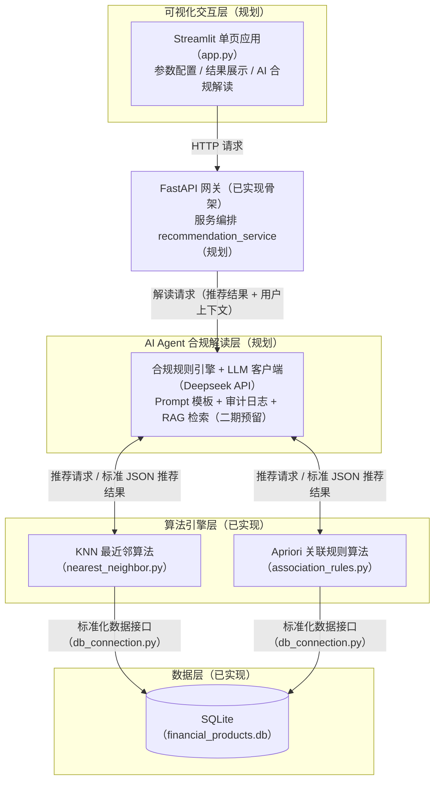

# 金融产品智能推荐系统需求说明文档

## 1. 文档信息

| 条目 | 内容 |
|---|---|
| 产品名称 | 金融产品智能推荐系统（合规版） |
| 产品定位 | 面向理财经理的轻量化金融智能辅助工具，基于双数据挖掘算法+AI大模型，实现金融产品智能匹配、行为挖掘、合规化结果解读，AI结果仅做辅助解读，强制人工复核，满足金融风控合规要求。 |
| 目标用户 | 银行/券商理财经理、金融客户经理、金融产品运营人员 |
| 版本号 | V1.1 |
| 文档用途 | 项目落地依据、产品设计方案沉淀 |
| 文档权威版本 | 本 Markdown 文件为唯一现行版本；历史 .docx 版本（《金融产品智能推荐Agent系统》产品需求文档（PRD）.docx）为存档，内容以本文件为准 |
| 实现状态 | 数据层/算法层/FastAPI 骨架已实现；Agent 层/服务编排层/交互层为规划，详见《项目落地清单.md》 |

### 1.1 修订记录

| 版本 | 日期 | 修订说明 | 修订人 |
|---|---|---|---|
| V1.0 | — | 初版 | — |
| V1.1 | 2026-09-03 | 对齐代码现状修正 5.3/6.1-6.3 等事实错误；建立「现状/规划」标注纪律；未实现项移入《项目落地清单.md》；修订依据见《需求文档评审报告.md》 | Alex |
| V1.1（补充） | 2026-09-03 | 8.3 补充公开部署演示模式（DEMO_MODE 开关）与部署现状（requirements.txt/一键启动脚本已落地） | Claude |

## 2. 项目背景与痛点分析

### 2.1 业务背景

金融理财业务中，理财经理需要根据用户**风险偏好、投资预算、历史购买行为**，为客户匹配适配的理财产品。传统金融CRM系统仅具备客户数据存储、产品展示、记录归档能力，缺乏智能分析能力，无法自动挖掘用户偏好与产品关联关系，理财经理人工筛选产品效率低、匹配主观性强、缺乏数据依据。

同时，通用AI对话工具存在**输出不专业、无金融约束、易产生投资建议、无法解释推荐逻辑**等合规问题，无法直接用于金融职场业务。

### 2.2 现存业务痛点

- **匹配效率低**：人工对照产品风险、起投金额、用户偏好筛选，耗时久、易出错
- **推荐无依据**：人工推荐主观化，无数据、算法指标支撑，客户说服力弱
- **新老用户无差异化**：新用户无行为数据、老用户有购买习惯，传统工具无法区分推荐策略
- **结果不可解释**：算法输出结果专业晦涩，理财经理无法快速理解匹配逻辑与风险适配性
- **合规风险高**：通用AI易输出收益承诺、投资指导等违规内容，不符合金融监管要求

### 2.3 产品解决方案

针对上述痛点，本产品构建了「算法精准匹配—AI合规解读—人工复核兜底」的三层递进式智能推荐体系，实现金融CRM从“数据记录工具”向“智能决策助手”的升级。

1. **底层算法双引擎驱动，实现精准匹配**

   基于客户画像与产品特征库，融合近邻匹配与关联规则算法，实现产品与客户的多维自动匹配：

   - 新客冷启动：依据投资偏好、预算等画像特征，通过特征向量加权近邻匹配快速生成初始推荐池，缩短首单决策周期；
   - 老客深度运营：基于历史购买行为挖掘产品关联规则，识别复购倾向与组合偏好，实现”已购A则推荐B”的精准关联；
   - 全量约束过滤（规划）：风险等级适配性、起投金额门槛、产品可售状态校验等硬性规则为二期增强方向（见《项目落地清单》），一期以输入边界裁剪与人工复核兜底。

   引擎输出每项推荐均附带推荐类型标签，关联推荐附带支持度/置信度等量化指标（匹配度评分为规划字段，见《项目落地清单》），为理财经理提供客观数据依据，增强客户说服力。

2. **中层AI Agent合规解读，弥合专业鸿沟**

   在算法输出与理财经理之间设置专属金融合规AI层，对推荐结果进行“翻译”与“把关”：

   - 结果通俗化：将算法指标转化为理财场景话术，如"该客户偏好稳健理财分类、预算5万元，所推荐产品风险等级为低风险，与客户偏好特征的距离为系统内最小，建议人工复核后使用"，降低理解门槛；
   - 逻辑可视化：自动生成推荐理由摘要（如"基于您过往偏好固收类产品，且同类型客户近期关注该产品"），让理财经理快速掌握适配逻辑；
   - 合规防火墙：内置金融监管规则库，拦截收益承诺、保本暗示、投资指导等违规表述，确保所有对外输出内容符合合规要求。

3. **顶层人工复核兜底，构建业务闭环**

   系统最终输出的推荐方案及AI解读，由理财经理进行”最后一公里”的人工复核。理财经理可依据自身对客户的感性认知，补充人情化话术、形成最终方案（推荐权重微调为二期规划，见《项目落地清单》）。该模式保留了人工的专业温度，同时借助算法大幅提升选品效率，形成”机器计算快、AI讲得清、人工把得准”的闭环业务模式。

## 3. 产品核心定位与价值

### 3.1 产品定位

金融场景轻量化智能辅助Agent，**只做分析、不做决策、不输出投资建议、不直接触达客户**，全程为理财经理提供内部业务参考，所有结果必须人工审核后使用。

### 3.2 核心价值

- **效率价值**：秒级完成产品筛选与匹配，替代人工统计、对比、筛选工作
- **精准价值**：双算法覆盖新老用户场景，基于特征相似度+用户行为挖掘，推荐结果可量化、可追溯
- **落地价值**：AI通俗解读算法指标，降低理财经理使用门槛，解决算法黑盒问题
- **合规价值**：全链路约束AI输出，规避金融营销违规风险，适配行业监管要求

## 4. 用户角色与场景分析

### 4.1 目标用户角色

理财经理/金融客户经理：负责客户维护、产品匹配、理财咨询、客户需求跟进，需要高效、合规、有数据依据的产品推荐辅助工具。

### 4.2 核心使用场景

1. **新客户无历史行为场景**：仅知晓用户投资类型、预算，通过KNN算法匹配相似度最高的理财产品，同时区分常规客户与特征异常客户，分别推送相似产品/热门高收益产品。
2. **老客户有购买记录场景**：基于用户历史购买行为，通过Apriori关联规则挖掘产品组合关联关系，推送高置信度关联产品。
3. **业务复盘与话术准备场景**：通过AI Agent解读推荐逻辑、产品风险、适配人群，辅助理财经理制作合规沟通话术与客户分析报告。

## 5. 产品整体功能架构

系统采用四层能力架构设计，自下而上分别为数据层、算法引擎层、AI Agent合规解读层和可视化交互层，各层职责清晰、接口规范，形成从数据存储到智能推荐再到人机交互的完整闭环。一期聚焦核心推荐能力与LLM基础解读体验，并为后续RAG增强预留扩展接口。

### 5.1 完整架构

<!-- 注：原文未含图形，下图为依据本节文字描述绘制的四层架构示意 -->



```text
Finance_CRM_Agent/
├── backend/
│   ├── main.py                           # FastAPI主入口 [现状]
│   ├── services/                         # 业务编排层 [规划]
│   │   └── recommendation_service.py     # 整合算法+Agent流水线 [规划]
│   ├── agent/                            # AI Agent核心包 [规划]
│   │   ├── compliance_engine.py          # 合规规则引擎（黑名单+正则校验）[规划]
│   │   ├── llm_client.py                 # LLM API客户端 [规划]
│   │   ├── prompt_templates.py           # System Prompt模板 [规划]
│   │   ├── rag_retriever.py              # RAG检索（一期Mock占位）[规划]
│   │   └── knowledge_base/               # 知识库目录（一期空，二期放文档）[规划]
│   ├── algorithms/                       # [现状]
│   │   ├── nearest_neighbor.py           # 最近邻推荐算法
│   │   └── association_rules.py          # 关联规则推荐算法
│   └── database/                         # [现状]
│       ├── db_connection.py              # 数据库连接（审计日志写入 [规划]）
│       └── financial_products.db         # SQLite数据库（三张业务表，首次数据访问时自动建表播种（惰性初始化））
├── frontend/                             # [规划]
│   └── app.py                            # Streamlit单页应用
└── requirements.txt                      # 依赖清单 [规划]

图例：[现状] = 已实现；[规划] = 未实现，见《项目落地清单.md》
```

技术栈总览：

| 层级 | 当前实现 | 目标形态 | 说明 |
|---|---|---|---|
| 数据层 | SQLite（过程式数据访问，无 ORM） | SQLite + DB Browser | 轻量级，零配置，适合本地开发 |
| 算法层 | Python 纯手写实现（仅标准库：KNN 加权欧氏距离 / Apriori 频繁项集） | 可迁移 scikit-learn KNN / mlxtend Apriori（可选演进） | 零第三方依赖；先手写理解原理，后可换成熟算法库 |
| Agent层 | 未实现（规划） | Deepseek API + 自建规则引擎 | 一期直接调用API，无需本地GPU |
| 交互层 | 未实现（规划） | Streamlit + Plotly + Requests | 纯Python，无需前端构建工具 |
| 编排层 | FastAPI 已实现骨架（POST 参数为约定式 dict） | FastAPI + Pydantic | 高性能API框架，自动生成接口文档；Pydantic 模型随编排层落地引入 |

### 5.2 数据层

【已实现】基于SQLite轻量级关系型数据库（`financial_products.db`）构建，模拟金融CRM核心数据环境。包含：

- sample_products：金融产品信息
- customer_records：历史购买记录（关联分析数据源）
- customer_inputs：用户推荐记录

（注：SQLite 内部自动维护的 sqlite_sequence 自增序列表非业务表，不计入数据模型。）

数据关系：

- 产品分类：70(稳健理财)、71(成长基金)、72(进取投资)
- 风险等级：低风险、中低风险、中风险、中高风险、高风险、极高风险
- 客户行为：通过购买记录构建事务数据库

数据层为上层算法提供标准化的数据输入接口（`db_connection.py`），模拟CRM系统的业务字段定义与产品分类规则，支持通过DB Browser for SQLite等工具进行可视化数据管理与校验。

### 5.3 算法引擎层

【已实现】采用双算法并行的推荐架构，提供核心推荐计算能力：

- KNN最近邻算法（`nearest_neighbor.py`）：基于客户投资类型、投资预算双维度特征与产品特征做加权近邻匹配，实现新客户无行为数据场景的冷启动推荐。输入投资偏好分类ID与投资金额，输出与输入画像最相近的 Top-K 产品列表（分类权重0.4/金额权重0.6，见6.2）
- Apriori关联规则算法（`association_rules.py`）：挖掘历史购买事务中的产品关联模式，发现”购买A产品的用户也常购买B产品”的规则。输入目标产品ID，输出关联产品列表及支持度/置信度指标（支持度0.2、置信度0.5为一期固定默认阈值，参数化见《项目落地清单》）

接口预留说明：算法层以标准JSON格式输出推荐结果（包含产品ID、推荐类型标签；关联推荐含支持度/置信度；匹配度评分为规划字段，见《项目落地清单》），该格式同时兼容后续AI Agent的输入接口规范，确保算法升级或替换时Agent层无需改动。

### 5.4 AI Agent层（一期）

【规划】金融合规专属大模型助手，负责结果解读、指标通俗释义、风险提示、合规校验。本节为规划描述，未实现项见《项目落地清单.md》。

**设计原则：一期优先完成LLM接入与基础解读能力验证，Agent层对外接口按完整架构设计预留，RAG检索模块以Mock实现占位，二期无缝升级。**

#### 整体架构

- 【一期核心】AI Agent合规解读层（含二期RAG接口预留）
  - 【一期完整】合规规则引擎（`compliance_engine.py`）
    - 关键词黑名单过滤 + 正则拦截 + 输出后校验
  - 【一期完整】LLM客户端（`llm_client.py`）
    - 接入Deepseek API，实现合规解读文本生成
  - 【一期完整】Prompt模板（`prompt_templates.py`）
    - 结构化System Prompt，约束输出格式与合规边界
  - 【一期完整】审计日志写入模块（写入 `agent_audit_log` 表）
    - 记录每次Agent调用（输入、输出、校验结果）
  - 【二期预留】RAG检索模块（`rag_retriever.py`）
    - 一期以Mock占位（返回空上下文），二期接入Chroma向量库无缝升级

#### 一期实现范围

| 模块 | 一期实现 | 二期预留 |
|---|---|---|
| 合规规则引擎 | 完整实现：关键词黑名单、正则拦截、输出后校验 | — |
| LLM客户端 | 接入Deepseek API，实现基础调用 | 增加更多模型适配、模型路由策略 |
| Prompt模板 | 设计基础System Prompt，约束输出格式与合规边界 | Few-shot样例库、动态Prompt生成 |
| RAG检索模块 | Mock占位：直接返回空上下文或预设文本 | 接入Chroma向量库、产品文档索引构建 |
| 审计日志 | 记录每次Agent调用（输入、输出、校验结果） | 增加成本统计、质量评分 |
| 接口定义 | 一期以约定式 dict 对接算法层（标准JSON字段见5.3），Schema 与 Pydantic 模型随服务编排层落地 | 编排层落地时统一修订 |

### 5.5 交互层

【规划】采用Streamlit框架构建轻量级Web交互界面，单页应用结构，实现算法参数配置、一键计算、结果展示与AI解读输出的全流程可视化。本节为规划描述，未实现项见《项目落地清单.md》：

#### 页面布局设计

- 【一期完整】可视化交互层（Streamlit）
  - 侧边栏参数配置：算法模式切换（KNN 相似推荐 / 关联规则推荐）、客户偏好分类、投资金额、关联目标产品；高级算法参数（K值/阈值）一期固定为后端默认值，不向业务侧开放（参数化见《项目落地清单》）
  - 主区域结果展示：推荐产品表格 + Plotly可视化图表（风险等级分布图先行；匹配度柱状图依赖算法输出补数值字段，见《项目落地清单》）
  - AI智能解读面板：一键生成合规解读 + 风险提示 + 免责声明
  - 与后端通过 RESTful API（FastAPI）对接

#### 实现要点

- 纯Python代码：单个`app.py`文件实现（一期不启用 `pages/` 多页拆分，避免扩大范围），无需Vue/Webpack等前端构建工具
- 状态管理：使用`st.session_state`管理推荐结果和AI解读状态，支持结果缓存与历史回溯
- 交互组件：
  - `st.sidebar` + `st.selectbox` / `st.number_input` 实现参数配置
  - `st.button` 触发推荐计算
  - `st.dataframe` / `st.table` 展示推荐结果表格
  - `st.plotly_chart` 展示Plotly交互式图表
  - `st.markdown` 渲染AI解读文本（支持Markdown格式）
- 接口调用：通过`requests`库调用后端FastAPI接口（`/api/recommend`和`/api/recommend/explain`）

#### 与后端对接方式

| 前端操作 | 后端接口 | 说明 |
|---|---|---|
| 页面加载（产品下拉/分类下拉） | `GET /api/products/`、`GET /api/products/all/`、`GET /api/categories/` | [现状] 获取产品与分类数据 |
| 点击”一键计算推荐” | `POST /api/recommend` | [现状] 传入算法类型+参数（KNN：method/category_id/price；关联：method/selected_product），返回推荐产品列表 |
| 点击”生成AI解读” | `POST /api/recommend/explain` | [规划] 传入推荐结果+用户上下文，返回合规解读 |

注：接口错误语义现状为 HTTP 200 + error 字段；错误码规范（4xx + 统一错误结构）见《项目落地清单.md》。

## 6. 详细功能需求

### 6.1 基础参数配置模块

#### 功能描述

支持理财经理自定义用户投资画像参数，用于驱动算法计算。

#### 字段说明

- 投资偏好类型：稳健理财、成长基金、进取投资（对应分类ID70/71/72）
- 预期起投金额：30000-250000 元自定义输入（与产品库起投区间一致；区间外输入由算法自动裁剪至边界，前端提示见《项目落地清单》）
- 关联规则目标产品：可选系统内所有金融产品

#### 交互规则

所有参数默认填充默认值，用户可自由修改，点击"一键计算推荐"后生效并驱动算法计算。

### 6.2 最近邻算法智能推荐模块

#### 功能描述

基于用户投资类型、起投金额双维度特征，通过加权欧几里得距离计算产品相似度，实现新用户无行为数据场景的智能推荐。

#### 算法规则

- 权重配置：产品分类权重0.4，投资金额权重0.6
- 特征处理：统一归一化处理，消除数值量纲影响
- 画像贴近度阈值：0.3（判定客户画像与产品库的贴近程度）
- 分流策略：对全部产品逐一计算与客户画像的距离，若最小距离≤0.3 → 整批输出相似产品推荐 Top6；若最小距离>0.3（特征异常客户，无产品贴近画像）→ 整批输出热门高收益产品 Top6
- 默认输出Top6推荐产品

#### 输出内容

产品名称、产品分类、风险等级、起投金额、预期收益、推荐策略说明（相似推荐/热门推荐）。（注：相似度数值现仅内部记录于 customer_inputs 表，对外输出与可视化字段见《项目落地清单》）

### 6.3 关联规则算法智能推荐模块

#### 功能描述

基于用户历史购买事务数据，通过Apriori算法挖掘产品频繁项集与强关联规则，实现老用户行为式产品推荐。

#### 算法规则

- 最小支持度：0.2（过滤低频无效组合）
- 最小置信度：0.5（筛选高可靠关联规则）
- 计算指标：支持度、置信度、关联分数（置信度×支持度）；提升度内部计算、一期不对外输出（开放见《项目落地清单》）
- 排序规则：按关联分数（置信度×支持度）降序排序

#### 输出内容

目标产品、关联推荐产品、支持度、置信度指标。（注：当关联推荐不足 Top6 时，以热门高收益产品补齐，补齐项推荐类型标注"热门推荐"）

### 6.4 AI合规Agent解读模块

#### 功能描述

【已实现】针对两类算法的原始推荐结果，进行**金融合规化、通俗化、业务化解读**，解决算法结果晦涩、无业务落地意义、存在合规风险的问题。解读为双模式（2026-09-04 落地）：`analysis` 模式输出合规解读（内部参考底稿，读者为理财经理，全文第三人称、禁止"您"直接称呼客户）；`script` 模式输出对客参考话术（结合客户画像生成理财经理跟进话术草稿，双区结构：对客参考话术 + 经理备注，算法指标原文只落备注区，风险揭示必带，标注"参考草稿·需人工复核·禁止系统自动发送"）。

#### Agent强制约束规则（金融监管适配）

- 禁止输出任何投资建议、买卖指导、收益承诺
- 仅客观解读匹配逻辑、风险等级、客户适配性
- 强制标注AI辅助分析、需人工复核免责声明
- 通俗解释相似度、支持度、置信度等专业算法指标
- 主动提示产品风险与客户偏好适配冲突点

#### 输出内容

analysis 模式（合规解读，五段）：推荐逻辑复盘、产品风险解读、客户适配分析、算法指标释义、合规风险提示。

script 模式（对客参考话术，五件套）：开场与需求确认（客户称呼占位、画像复述不虚构、提问收尾）、产品介绍要点（Top1-2 展开，要点备稿非逐字稿）、风险揭示（必带，按风险等级映射）、异议处理参考（禁贬损同业/时间压力/绝对化）、收尾与流程提示。话术为 AI 参考草稿，需理财经理人工复核后使用，系统禁止自动发送。

### 6.5 全局合规声明模块

【规划】页面常驻合规提示，明确系统仅为内部业务辅助工具，不构成投资建议，所有结果需理财经理人工复核后使用，规避业务与合规风险。

## 7. 业务流程设计

### 7.1 整体业务流程

1. 理财经理录入客户投资偏好、起投金额、目标产品参数
2. 触发对应算法引擎，系统完成批量计算、数据匹配、指标生成
3. 页面展示结构化算法推荐结果与推荐类型/置信度指标（关联推荐路径含数值指标）
4. AI Agent自动生成合规业务解读文案
5. 理财经理人工审核结果，参考解读文案完成客户运营工作

### 7.2 核心风控流程

算法原始结果输出 → AI合规约束过滤 → 页面免责声明展示 → **人工终审确认** → 业务使用，全程无自动决策、无自动触达、无违规输出。

## 8. 非功能需求

### 8.1 性能需求

- 算法计算响应时间≤1s（现状实测毫秒级；不含首次启动建表播种的一次性冷启动成本）
- AI解读响应时间：目标 P95≤3s；一期实现超时与降级策略——调用超时/失败时回退预置合规解读模板并标注"基础版解读"，保证离线或异常时功能不中断（设计见《项目落地清单》）

### 8.2 合规需求（核心）

- 全程无投资建议、无收益承诺、无交易指导内容
- 所有AI输出自带人工复核声明
- 禁止任何自动化对外触达能力

### 8.3 可用性需求

- 轻量化部署：纯 Python 无前端构建，本地 SQLite 零配置；依赖清单 requirements.txt 与一键启动脚本已落地（start_demo.bat）
- 公开部署演示模式：通过 DEMO_MODE 环境变量开关禁用 LLM 调用，解读返回预置样例文本（本地默认关闭，自由调用 LLM）
- 页面简洁直观，无专业技术门槛，业务人员可直接使用

## 9. 页面原型说明

【规划】系统整体分为**侧边参数配置区**、**核心功能按钮区**、**算法结果展示区**、**AI合规解读区**、**底部合规声明区**五大模块，页面逻辑清晰、业务流程闭环，完全适配理财经理日常使用场景。交互层落地后回填原型截图（见《项目落地清单》）。

## 10. 项目亮点与创新总结

- **算法与AI双引擎融合**：区别于纯大模型对话项目，以传统数据挖掘算法为精准底座（已实现），大模型解决可解释性痛点（规划中），兼顾精准度与落地性
- **金融强合规产品设计**：产品层红线（只做分析、不做决策）已落地；Prompt层/页面层风控随 Agent 层与交互层落地，三重风控设计规避金融AI常见合规漏洞
- **场景差异化设计**：双算法精准覆盖新老两类用户场景，解决传统推荐系统场景单一问题
- **轻量化工程落地**：纯 Python 技术栈规避复杂后端部署，以产品思维驱动轻量化Demo（数据层/算法层已实现，其余见《项目落地清单》）

## 11. 版本迭代规划

| 层级 | 一期实现 | 二期增强 |
|---|---|---|
| 数据层 | SQLite基础表结构 + agent_audit_log 审计日志表 | 增加产品文档表（供RAG索引） |
| 算法层 | KNN + Apriori 完整实现 | 算法效果调优、增加协同过滤备选 |
| Agent层 | LLM API接入 + 合规规则引擎 + agent_audit_log 审计日志写入 + RAG接口Mock占位 | RAG检索模块上线 + 知识库构建 + 上下文增强 |
| 交互层 | Streamlit基础界面 + 推荐展示 + AI解读展示 | 增加历史推荐记录、用户反馈收集 |
